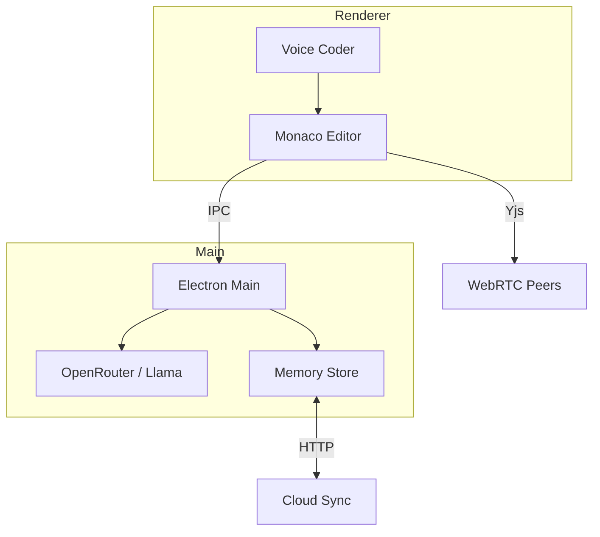

# Architecture

The project uses an Electron shell with a web-based renderer. The renderer hosts the Monaco editor and communicates with the Node.js main process via IPC. OpenRouter or a local `llama.cpp` binary provides completions. Chat history is stored on disk and can be synced to a remote service.

